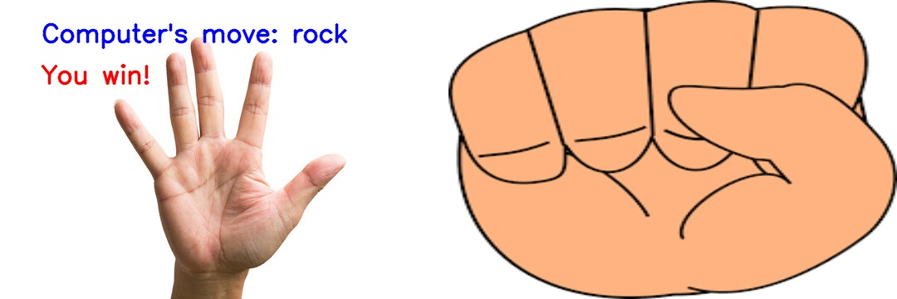

# Interactive Rock-Paper-Scissors Using Hand Gesture Recognition
Step into the world of interactive Rock-Paper-Scissors experience, enhanced with real-time hand gesture recognition. Using advanced computer vision techniques, this engaging setup allows players to make traditional moves naturally in front of a webcam, pitting them against a computer opponent that randomly selects its plays. The system intelligently interprets the player's hand gestures, making for an intuitive and dynamic gaming experience. Whether you're settling a friendly dispute or simply passing the time, this modern twist on a classic game offers a unique blend of nostalgia and cutting-edge technology.
## Demo from static image 

